# Diagrama de Flujo de Usuario Completo - MagicStars Frontend

## 1. Flujo Principal de Navegación

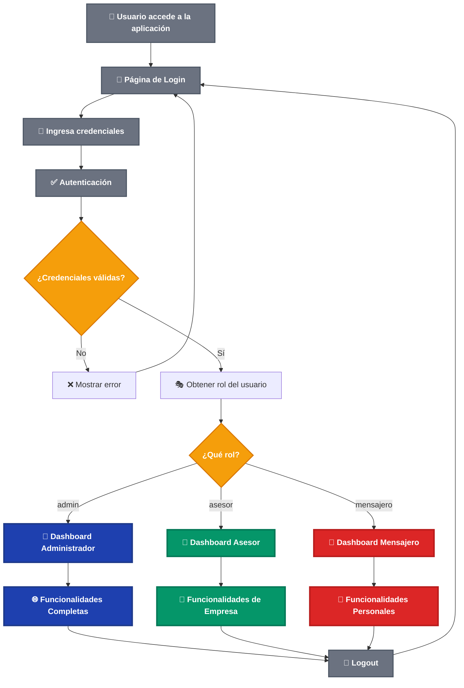

## 1.1. Comparación Visual de Dashboards

```mermaid
graph TB
    subgraph "👑 ADMINISTRADOR - Control Total"
        A1[🎯 Dashboard Principal]
        A1 --> A2[📊 9 Módulos Principales]
        A2 --> A3[🌍 Acceso Global]
        A3 --> A4[⚙️ Gestión Completa]
        A4 --> A5[📈 Estadísticas Globales]
    end
    
    subgraph "🏢 ASESOR - Gestión Empresarial"
        B1[🏢 Dashboard Empresarial]
        B1 --> B2[📦 5 Módulos de Empresa]
        B2 --> B3[🏢 Solo su Empresa]
        B3 --> B4[📋 Gestión Limitada]
        B4 --> B5[📊 Estadísticas de Empresa]
    end
    
    subgraph "🚚 MENSAJERO - Operaciones de Campo"
        C1[📱 Dashboard Personal]
        C1 --> C2[🚚 4 Módulos Personales]
        C2 --> C3[👤 Solo sus Datos]
        C3 --> C4[📦 Gestión de Entregas]
        C4 --> C5[💰 Liquidación de Gastos]
    end
    
    %% Estilos para mejor visibilidad
    classDef adminStyle fill:#1e40af,stroke:#1e3a8a,stroke-width:2px,color:#ffffff,font-weight:bold
    classDef asesorStyle fill:#059669,stroke:#047857,stroke-width:2px,color:#ffffff,font-weight:bold
    classDef mensajeroStyle fill:#dc2626,stroke:#b91c1c,stroke-width:2px,color:#ffffff,font-weight:bold
    
    class A1,A2,A3,A4,A5 adminStyle
    class B1,B2,B3,B4,B5 asesorStyle
    class C1,C2,C3,C4,C5 mensajeroStyle
```

## 2. Flujo de Dashboard Administrador

```mermaid
graph TD
    A[🎯 DASHBOARD ADMINISTRADOR] --> B[📊 Resumen General]
    A --> C[📦 Gestión de Pedidos]
    A --> D[📋 Gestión de Inventario]
    A --> E[🌐 Logística Externa]
    A --> F[🚚 Gestión de Rutas]
    A --> G[💰 Liquidaciones]
    A --> H[👥 Gestión de Usuarios]
    A --> I[🏢 Gestión de Empresas]
    A --> J[📈 Estadísticas]
    
    B --> B1[📊 Métricas Globales]
    B --> B2[🚨 Alertas del Sistema]
    B --> B3[⚡ Actividad Reciente]
    
    C --> C1[👀 Ver Todos los Pedidos]
    C --> C2[➕ Crear Pedido Manual]
    C --> C3[📤 Subir CSV de Pedidos]
    C --> C4[⚙️ Gestionar Estados]
    
    D --> D1[🌍 Inventario Global]
    D --> D2[➕ Crear Productos]
    D --> D3[📊 Ajustar Stock]
    D --> D4[📜 Ver Historial]
    
    E --> E1[🚛 Gestionar Envíos Externos]
    E --> E2[📍 Tracking de Pedidos]
    E --> E3[📊 Estadísticas de Logística]
    
    F --> F1[🛣️ Crear Rutas]
    F --> F2[👥 Asignar 30 Pedidos por Mensajero]
    F --> F3[🔄 Gestionar Asignaciones]
    F --> F4[📊 Monitorear Progreso]
    
    G --> G1[👀 Revisar Liquidaciones]
    G --> G2[✅ Aprobar Pagos]
    G --> G3[💰 Estadísticas Financieras]
    
    H --> H1[➕ Crear Usuarios]
    H --> H2[🎭 Asignar Roles]
    H --> H3[🔐 Gestionar Permisos]
    
    I --> I1[🏢 Crear Empresas]
    I --> I2[👤 Asignar Asesores]
    I --> I3[⚙️ Gestionar Configuraciones]
    
    J --> J1[📊 Reportes Globales]
    J --> J2[📈 Análisis de Tendencias]
    J --> J3[📤 Exportar Datos]
    
    %% Estilos para mejor visibilidad
    classDef adminMain fill:#1e40af,stroke:#1e3a8a,stroke-width:3px,color:#ffffff,font-weight:bold
    classDef adminSection fill:#3b82f6,stroke:#2563eb,stroke-width:2px,color:#ffffff,font-weight:bold
    classDef adminAction fill:#60a5fa,stroke:#3b82f6,stroke-width:1px,color:#1e40af,font-weight:normal
    
    class A adminMain
    class B,C,D,E,F,G,H,I,J adminSection
    class B1,B2,B3,C1,C2,C3,C4,D1,D2,D3,D4,E1,E2,E3,F1,F2,F3,F4,G1,G2,G3,H1,H2,H3,I1,I2,I3,J1,J2,J3 adminAction
```

## 3. Flujo de Dashboard Asesor

```mermaid
graph TD
    A[🏢 DASHBOARD ASESOR] --> B[📊 Resumen de Empresa]
    A --> C[📦 Pedidos de mi Empresa]
    A --> D[📋 Inventario de mi Empresa]
    A --> E[🌐 Logística Externa de mi Empresa]
    A --> F[📈 Estadísticas de mi Empresa]
    
    B --> B1[📊 Métricas de mi Empresa]
    B --> B2[⏳ Pedidos Pendientes]
    B --> B3[⚠️ Stock Bajo]
    
    C --> C1[👀 Ver Pedidos de mi Empresa]
    C --> C2[➕ Crear Pedido para mi Empresa]
    C --> C3[📤 Subir CSV para mi Empresa]
    C --> C4[⚙️ Gestionar Estados de mi Empresa]
    
    D --> D1[👀 Ver Productos de mi Empresa]
    D --> D2[➕ Crear Producto para mi Empresa]
    D --> D3[📊 Ajustar Stock de mi Empresa]
    D --> D4[📜 Ver Historial de mi Empresa]
    
    E --> E1[🚛 Gestionar Envíos de mi Empresa]
    E --> E2[📍 Tracking de Pedidos de mi Empresa]
    E --> E3[📊 Estadísticas de mi Empresa]
    
    F --> F1[📊 Reportes de mi Empresa]
    F --> F2[📈 Análisis de Ventas]
    F --> F3[📤 Exportar Datos de mi Empresa]
    
    %% Estilos para mejor visibilidad
    classDef asesorMain fill:#059669,stroke:#047857,stroke-width:3px,color:#ffffff,font-weight:bold
    classDef asesorSection fill:#10b981,stroke:#059669,stroke-width:2px,color:#ffffff,font-weight:bold
    classDef asesorAction fill:#34d399,stroke:#10b981,stroke-width:1px,color:#047857,font-weight:normal
    
    class A asesorMain
    class B,C,D,E,F asesorSection
    class B1,B2,B3,C1,C2,C3,C4,D1,D2,D3,D4,E1,E2,E3,F1,F2,F3 asesorAction
```

## 4. Flujo de Dashboard Mensajero

```mermaid
graph TD
    A[🚚 DASHBOARD MENSAJERO] --> B[📦 Mis Pedidos Asignados]
    A --> C[📜 Historial de Rutas]
    A --> D[💰 Gestión de Gastos]
    A --> E[👤 Mi Perfil]
    
    B --> B1[👀 Ver Pedidos del Día]
    B --> B2[✅ Actualizar Estado de Entrega]
    B --> B3[↩️ Registrar Devoluciones]
    B --> B4[📅 Reagendar Entregas]
    
    C --> C1[👀 Ver Rutas Anteriores]
    C --> C2[📊 Estadísticas de Entregas]
    C --> C3[💰 Historial de Gastos]
    
    D --> D1[➕ Registrar Gastos de Ruta]
    D --> D2[📷 Subir Comprobantes]
    D --> D3[🏷️ Categorizar Gastos]
    D --> D4[🧮 Calcular Totales]
    
    E --> E1[👀 Ver Mi Información]
    E --> E2[✏️ Actualizar Datos Personales]
    E --> E3[🔐 Cambiar Contraseña]
    E --> E4[📊 Ver Mis Estadísticas]
    
    %% Estilos para mejor visibilidad
    classDef mensajeroMain fill:#dc2626,stroke:#b91c1c,stroke-width:3px,color:#ffffff,font-weight:bold
    classDef mensajeroSection fill:#ef4444,stroke:#dc2626,stroke-width:2px,color:#ffffff,font-weight:bold
    classDef mensajeroAction fill:#f87171,stroke:#ef4444,stroke-width:1px,color:#b91c1c,font-weight:normal
    
    class A mensajeroMain
    class B,C,D,E mensajeroSection
    class B1,B2,B3,B4,C1,C2,C3,D1,D2,D3,D4,E1,E2,E3,E4 mensajeroAction
```

## 5. Flujo de Creación de Pedido

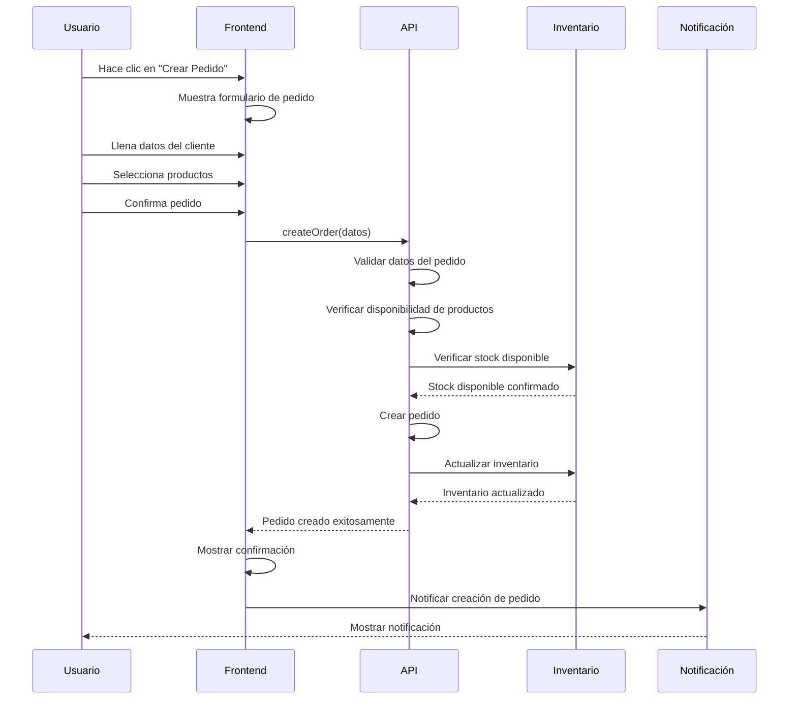

## 6. Flujo de Subida de CSV

```mermaid
flowchart TD
    A[Usuario selecciona "Subir CSV"] --> B[Seleccionar archivo CSV]
    B --> C[Validar formato del archivo]
    C --> D{¿Formato válido?}
    
    D -->|No| E[Mostrar error de formato]
    E --> B
    
    D -->|Sí| F[Procesar archivo CSV]
    F --> G[Validar datos de pedidos]
    G --> H{¿Datos válidos?}
    
    H -->|No| I[Mostrar errores de validación]
    I --> J[Permitir corrección]
    J --> G
    
    H -->|Sí| K[Verificar productos en inventario]
    K --> L{¿Todos los productos encontrados?}
    
    L -->|Sí| M[Crear todos los pedidos]
    L -->|No| N[Mostrar tabla de mapeo]
    
    N --> O[Usuario mapea productos no encontrados]
    O --> P[Confirmar mapeo]
    P --> M
    
    M --> Q[Mostrar resumen de pedidos creados]
    Q --> R[Confirmar creación]
    R --> S[Crear pedidos en sistema]
    S --> T[Mostrar confirmación final]
```

## 7. Flujo de Gestión de Rutas

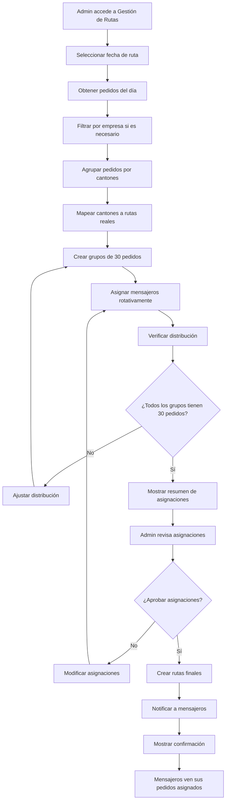

## 8. Flujo de Liquidación de Rutas

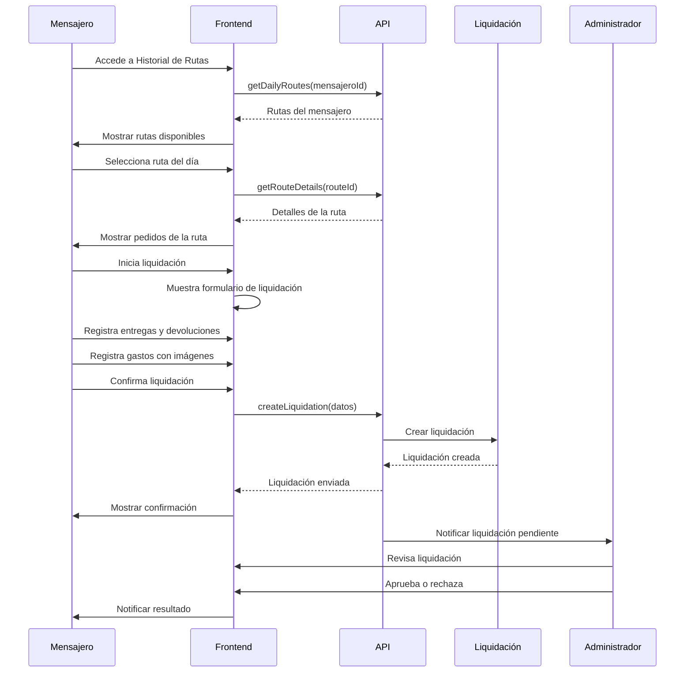

## 9. Flujo de Gestión de Inventario

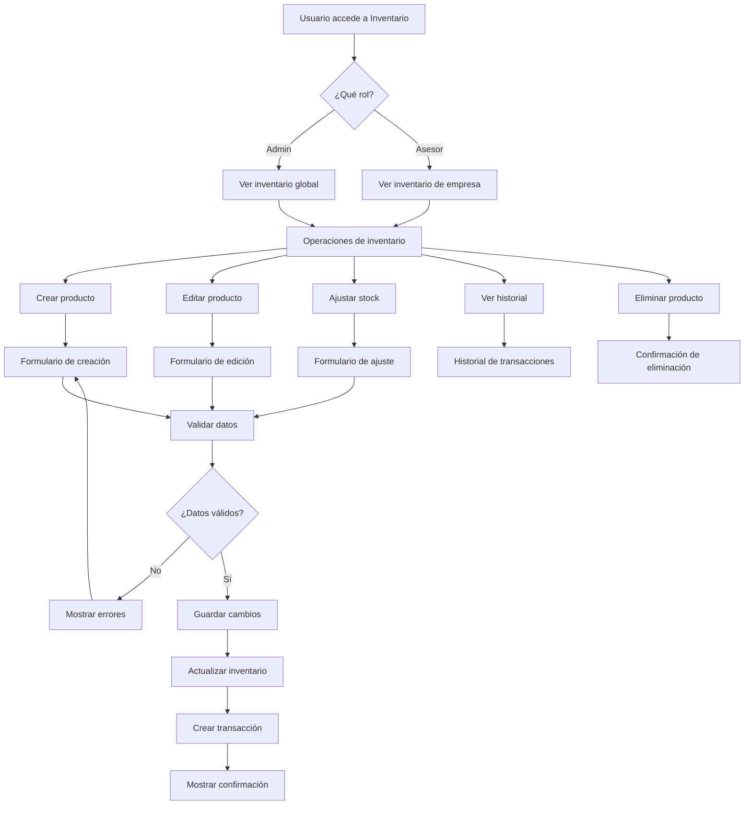

## 10. Flujo de Autenticación y Autorización

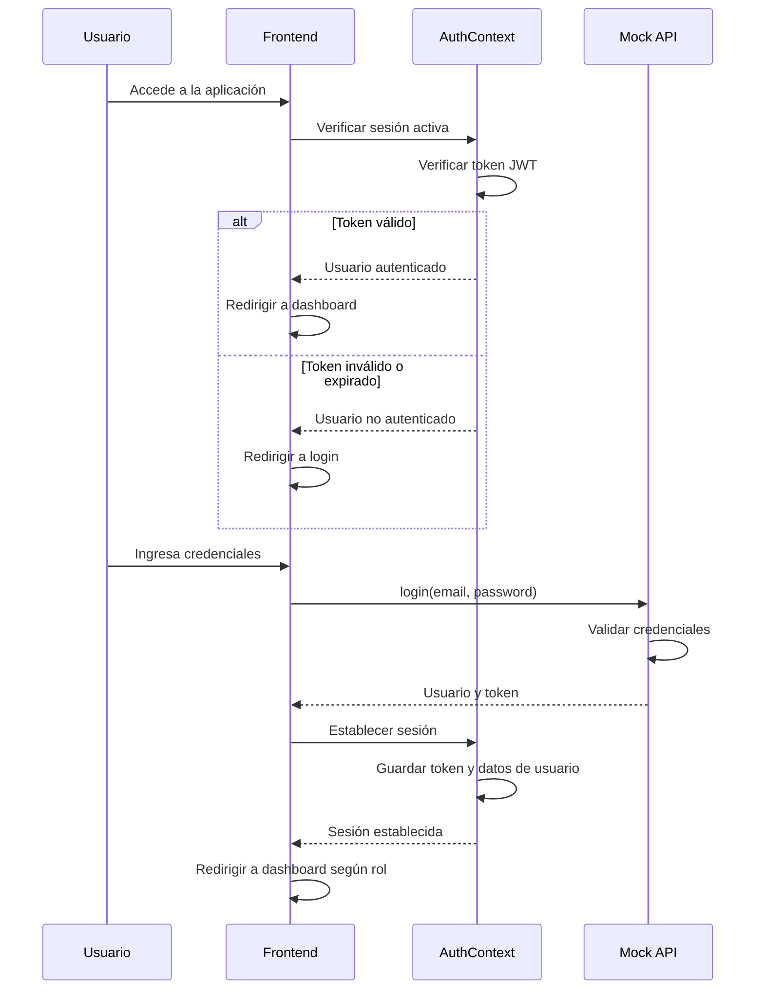

## 11. Flujo de Notificaciones

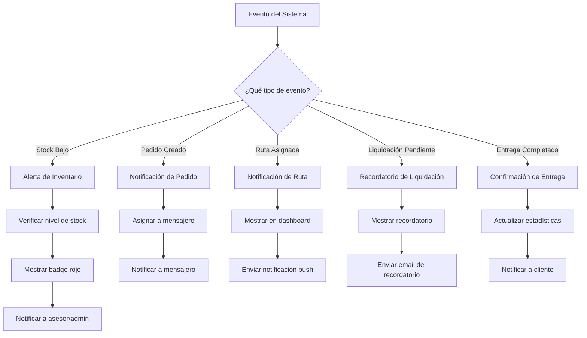

## 12. Flujo de Búsqueda y Filtros

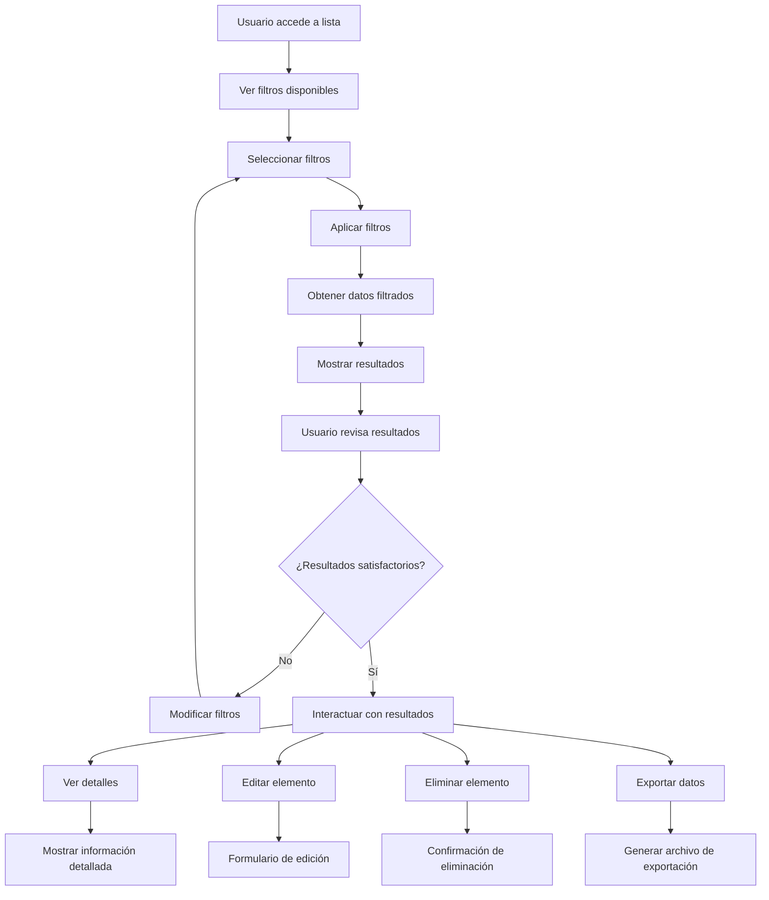

## 13. Flujo de Manejo de Errores

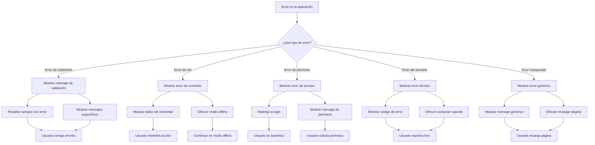

## 14. Flujo de Exportación de Datos

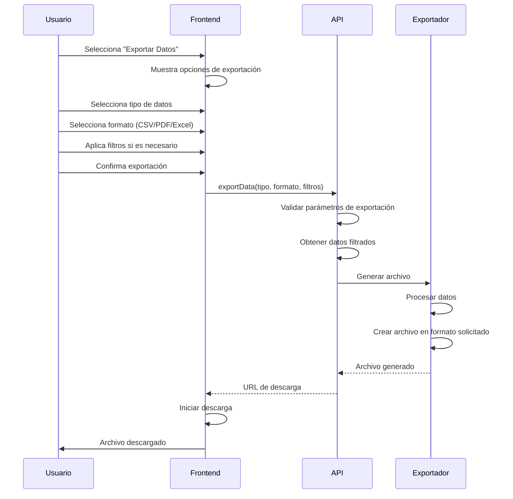

## 15. Flujo de Configuración de Usuario

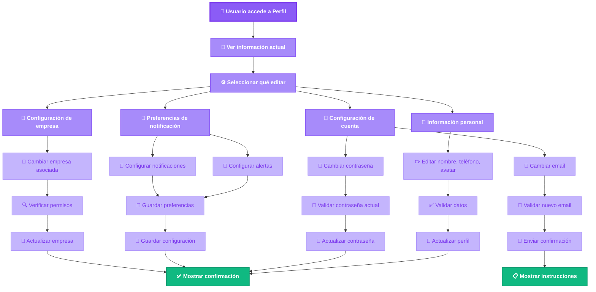

## 16. Resumen de Funcionalidades por Rol - Vista Mejorada

```mermaid
graph LR
    subgraph "👑 ADMINISTRADOR"
        A1[🎯 Control Total del Sistema]
        A1 --> A2[👥 Gestión de Usuarios]
        A1 --> A3[🏢 Gestión de Empresas]
        A1 --> A4[📦 Inventario Global]
        A1 --> A5[🚚 Gestión de Rutas]
        A1 --> A6[💰 Aprobación de Liquidaciones]
        A1 --> A7[📊 Estadísticas Globales]
        
        A2 --> A2a[➕ Crear Usuarios]
        A2 --> A2b[🎭 Asignar Roles]
        A2 --> A2c[🔐 Gestionar Permisos]
        
        A3 --> A3a[🏢 Crear Empresas]
        A3 --> A3b[👤 Asignar Asesores]
        A3 --> A3c[⚙️ Configuraciones]
        
        A4 --> A4a[🌍 Ver Todo el Inventario]
        A4 --> A4b[➕ Crear Productos]
        A4 --> A4c[📊 Ajustar Stock]
        A4 --> A4d[📜 Ver Historial]
        
        A5 --> A5a[🛣️ Crear Rutas]
        A5 --> A5b[👥 Asignar 30 Pedidos/Mensajero]
        A5 --> A5c[🔄 Gestionar Asignaciones]
        A5 --> A5d[📊 Monitorear Progreso]
    end
    
    subgraph "🏢 ASESOR"
        B1[🏢 Gestión de su Empresa]
        B1 --> B2[📦 Pedidos de su Empresa]
        B1 --> B3[📋 Inventario de su Empresa]
        B1 --> B4[🌐 Logística Externa]
        B1 --> B5[📊 Estadísticas de Empresa]
        
        B2 --> B2a[👀 Ver Pedidos]
        B2 --> B2b[➕ Crear Pedidos]
        B2 --> B2c[📤 Subir CSV]
        B2 --> B2d[⚙️ Gestionar Estados]
        
        B3 --> B3a[👀 Ver Productos]
        B3 --> B3b[➕ Crear Productos]
        B3 --> B3c[📊 Ajustar Stock]
        B3 --> B3d[📜 Ver Historial]
        
        B4 --> B4a[🚛 Gestionar Envíos]
        B4 --> B4b[📍 Tracking de Pedidos]
        B4 --> B4c[📊 Estadísticas]
        
        B5 --> B5a[📊 Reportes]
        B5 --> B5b[📈 Análisis de Ventas]
        B5 --> B5c[📤 Exportar Datos]
    end
    
    subgraph "🚚 MENSAJERO"
        C1[👤 Gestión Personal]
        C1 --> C2[📦 Mis Pedidos Asignados]
        C1 --> C3[📜 Historial de Rutas]
        C1 --> C4[💰 Gestión de Gastos]
        C1 --> C5[👤 Mi Perfil]
        
        C2 --> C2a[👀 Ver Pedidos del Día]
        C2 --> C2b[✅ Actualizar Estado]
        C2 --> C2c[↩️ Registrar Devoluciones]
        C2 --> C2d[📅 Reagendar Entregas]
        
        C3 --> C3a[👀 Ver Rutas Anteriores]
        C3 --> C3b[📊 Estadísticas de Entregas]
        C3 --> C3c[💰 Historial de Gastos]
        
        C4 --> C4a[➕ Registrar Gastos]
        C4 --> C4b[📷 Subir Comprobantes]
        C4 --> C4c[🏷️ Categorizar Gastos]
        C4 --> C4d[🧮 Calcular Totales]
        
        C5 --> C5a[👀 Ver Mi Información]
        C5 --> C5b[✏️ Actualizar Datos]
        C5 --> C5c[🔐 Cambiar Contraseña]
        C5 --> C5d[📊 Ver Mis Estadísticas]
    end
    
    %% Estilos para mejor visibilidad
    classDef adminMain fill:#1e40af,stroke:#1e3a8a,stroke-width:3px,color:#ffffff,font-weight:bold
    classDef adminSub fill:#3b82f6,stroke:#2563eb,stroke-width:2px,color:#ffffff,font-weight:bold
    classDef adminAction fill:#60a5fa,stroke:#3b82f6,stroke-width:1px,color:#1e40af,font-weight:normal
    
    classDef asesorMain fill:#059669,stroke:#047857,stroke-width:3px,color:#ffffff,font-weight:bold
    classDef asesorSub fill:#10b981,stroke:#059669,stroke-width:2px,color:#ffffff,font-weight:bold
    classDef asesorAction fill:#34d399,stroke:#10b981,stroke-width:1px,color:#047857,font-weight:normal
    
    classDef mensajeroMain fill:#dc2626,stroke:#b91c1c,stroke-width:3px,color:#ffffff,font-weight:bold
    classDef mensajeroSub fill:#ef4444,stroke:#dc2626,stroke-width:2px,color:#ffffff,font-weight:bold
    classDef mensajeroAction fill:#f87171,stroke:#ef4444,stroke-width:1px,color:#b91c1c,font-weight:normal
    
    class A1 adminMain
    class A2,A3,A4,A5,A6,A7 adminSub
    class A2a,A2b,A2c,A3a,A3b,A3c,A4a,A4b,A4c,A4d,A5a,A5b,A5c,A5d adminAction
    
    class B1 asesorMain
    class B2,B3,B4,B5 asesorSub
    class B2a,B2b,B2c,B2d,B3a,B3b,B3c,B3d,B4a,B4b,B4c,B5a,B5b,B5c asesorAction
    
    class C1 mensajeroMain
    class C2,C3,C4,C5 mensajeroSub
    class C2a,C2b,C2c,C2d,C3a,C3b,C3c,C4a,C4b,C4c,C4d,C5a,C5b,C5c,C5d mensajeroAction
```

---

## Resumen de Flujos de Usuario

### **Flujos Principales por Rol**

#### **Administrador**
- 🔐 **Autenticación completa** con acceso a todas las funcionalidades
- 📊 **Dashboard global** con métricas de todo el sistema
- 👥 **Gestión de usuarios y empresas** con control total
- 📦 **Gestión de inventario global** con visibilidad completa
- 🚚 **Gestión de rutas** con asignación de 30 pedidos por mensajero
- 💰 **Liquidaciones** con aprobación de pagos
- 📈 **Estadísticas globales** con análisis completo

#### **Asesor**
- 🔐 **Autenticación limitada** a su empresa
- 🏢 **Dashboard empresarial** con métricas de su empresa
- 📦 **Gestión de inventario** limitada a su empresa
- 📋 **Gestión de pedidos** para su empresa
- 🚚 **Logística externa** para su empresa
- 📊 **Estadísticas** de su empresa únicamente

#### **Mensajero**
- 🔐 **Autenticación personal** con acceso limitado
- 📱 **Dashboard personal** con sus pedidos asignados
- 🚚 **Gestión de rutas** con sus pedidos del día
- 💰 **Liquidación de gastos** con registro de comprobantes
- 📊 **Historial personal** de entregas y rutas

### **Características Comunes**
- ✅ **Navegación intuitiva** con menús contextuales por rol
- 🔍 **Búsqueda y filtros** avanzados en todas las listas
- 📱 **Responsive design** para uso en móviles y tablets
- 🔔 **Sistema de notificaciones** en tiempo real
- 📊 **Dashboards interactivos** con métricas en tiempo real
- 🚨 **Manejo de errores** robusto con mensajes claros
- 📤 **Exportación de datos** en múltiples formatos
- ⚙️ **Configuración personal** de usuario

*Estos flujos de usuario proporcionan una experiencia completa y diferenciada según el rol, manteniendo la consistencia en la interfaz y funcionalidades comunes.*
