# Diagrama de Gestión de Rutas - Sistema de 30 Pedidos por Mensajero

## 1. Flujo Principal de Gestión de Rutas

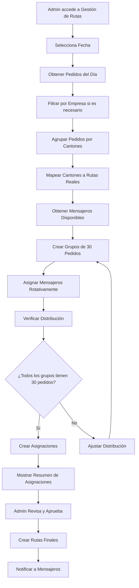

## 2. Mapeo de Cantones a Rutas Reales

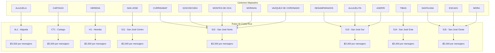

## 3. Distribución de Mensajeros por Ruta

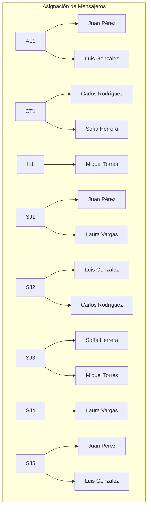

## 4. Proceso de Creación de Grupos de 30 Pedidos

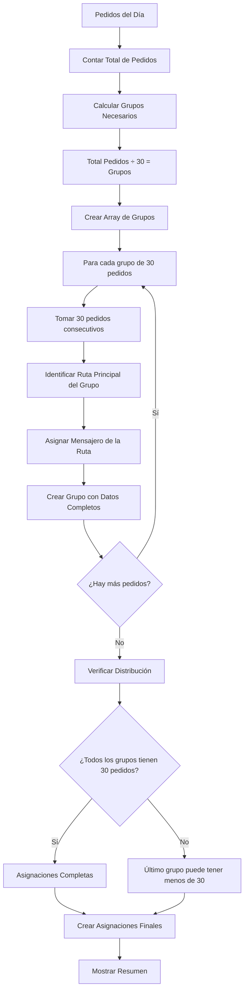

## 5. Interfaz de Usuario - Pestañas de Gestión

```mermaid
graph TD
    A[Página de Gestión de Rutas] --> B[Pestaña: Pedidos]
    A --> C[Pestaña: Rutas]
    A --> D[Pestaña: Asignaciones]
    A --> E[Pestaña: Rutas Disponibles]
    A --> F[Pestaña: Estadísticas]
    
    B --> B1[Lista de Pedidos del Día]
    B --> B2[Filtros por Empresa/Fecha]
    B --> B3[Información de Cliente]
    
    C --> C1[Grupos de 30 Pedidos]
    C --> C2[Mensajero Asignado]
    C --> C3[Estado de Completitud]
    C --> C4[Progreso Visual]
    
    D --> D1[Asignaciones por Mensajero]
    D --> D2[Progreso 30/30]
    D --> D3[Estadísticas de Entrega]
    D --> D4[Botón de Cambio]
    
    E --> E1[Información de Rutas]
    E --> E2[Zonas por Ruta]
    E --> E3[Pago por Mensajero]
    E --> E4[Mensajeros Asignados]
    
    F --> F1[Estadísticas de Mensajeros]
    F --> F2[Métricas de Eficiencia]
    F --> F3[Comparativas por Ruta]
    F --> F4[Reportes de Rendimiento]
```

## 6. Flujo de Asignación Automática

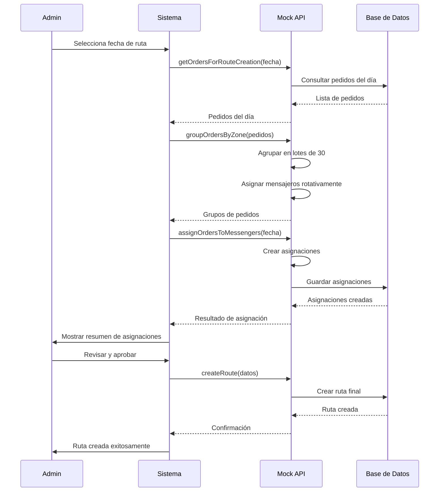

## 7. Validación y Verificación de Asignaciones

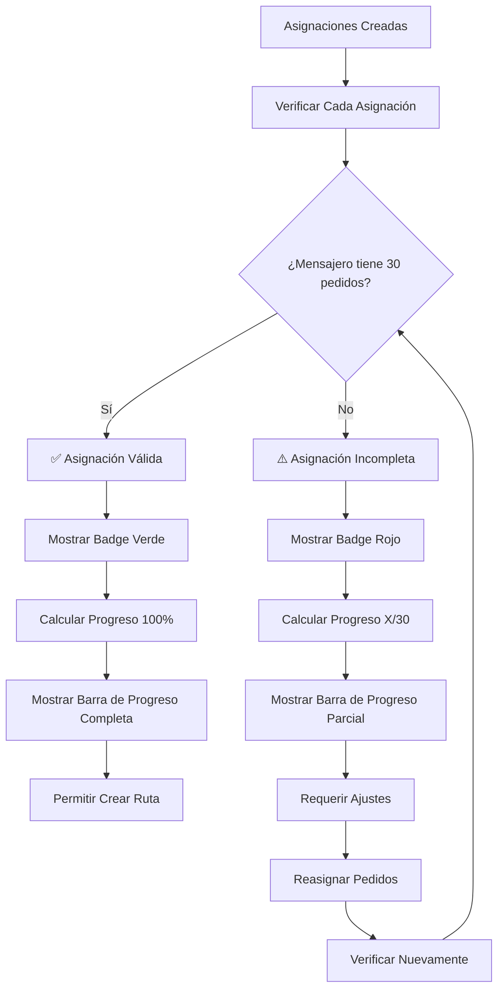

## 8. Estadísticas y Métricas por Mensajero

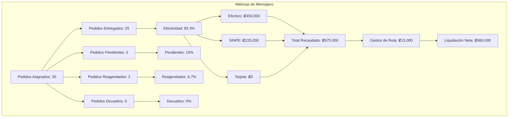

## 9. Flujo de Cambio de Asignación

```mermaid
flowchart TD
    A[Admin selecciona "Cambiar Asignación"] --> B[Mostrar Modal de Cambio]
    B --> C[Seleccionar Nuevo Mensajero]
    C --> D[Verificar Disponibilidad]
    
    D --> E{¿Mensajero disponible?}
    E -->|No| F[Mostrar Error]
    E -->|Sí| G[Confirmar Cambio]
    
    G --> H[Actualizar Asignación]
    H --> I[Notificar Mensajero Anterior]
    I --> J[Notificar Nuevo Mensajero]
    J --> K[Actualizar Estadísticas]
    K --> L[Refrescar Vista]
    
    F --> M[Volver a Selección]
    M --> C
```

## 10. Integración con Sistema de Liquidación

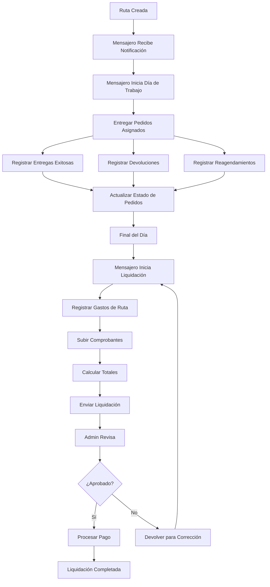

## 11. Dashboard de Monitoreo en Tiempo Real

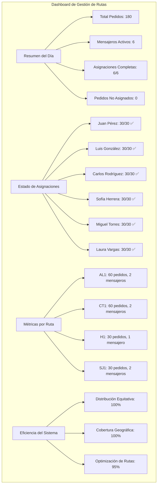

## 12. Flujo de Error y Recuperación

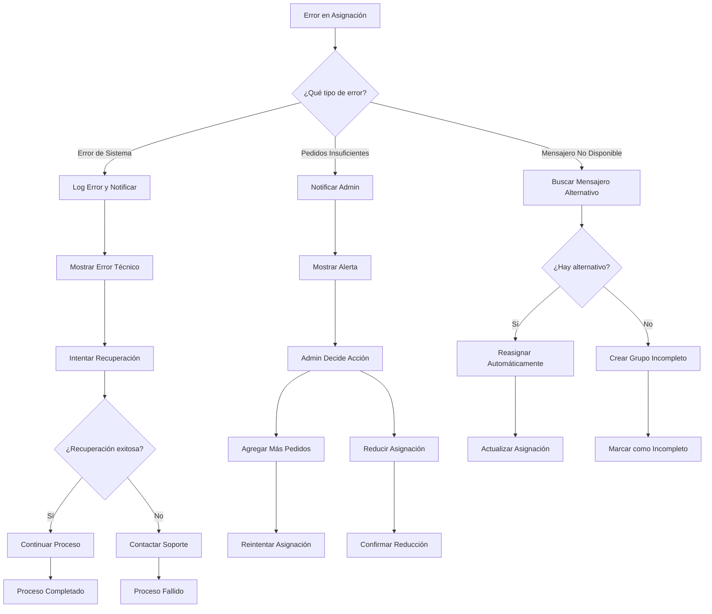

---

## Resumen del Sistema de Gestión de Rutas

### **Características Principales**
- ✅ **30 pedidos por mensajero**: Distribución equitativa y predecible
- ✅ **Rutas reales de Costa Rica**: Mapeo geográfico preciso
- ✅ **Asignación automática**: Sistema inteligente de distribución
- ✅ **Monitoreo en tiempo real**: Seguimiento completo del progreso
- ✅ **Gestión de errores**: Recuperación automática y manual
- ✅ **Integración completa**: Con liquidaciones y estadísticas

### **Beneficios Operacionales**
- 🎯 **Eficiencia logística**: Optimización basada en geografía real
- 📊 **Control total**: Visibilidad completa del proceso
- ⚡ **Automatización**: Reducción de trabajo manual
- 🔄 **Escalabilidad**: Fácil adaptación a más mensajeros
- 💰 **Optimización de costos**: Distribución eficiente de recursos

*Este sistema garantiza que cada mensajero tenga exactamente 30 pedidos asignados, proporcionando una gestión logística eficiente y predecible.*
