# Diagrama de Sistema de Inventario - MagicStars Frontend

## 1. Arquitectura del Sistema de Inventario

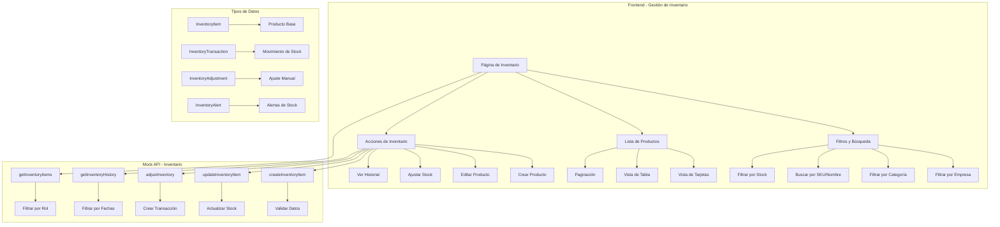

## 2. Flujo de Gestión de Productos por Rol

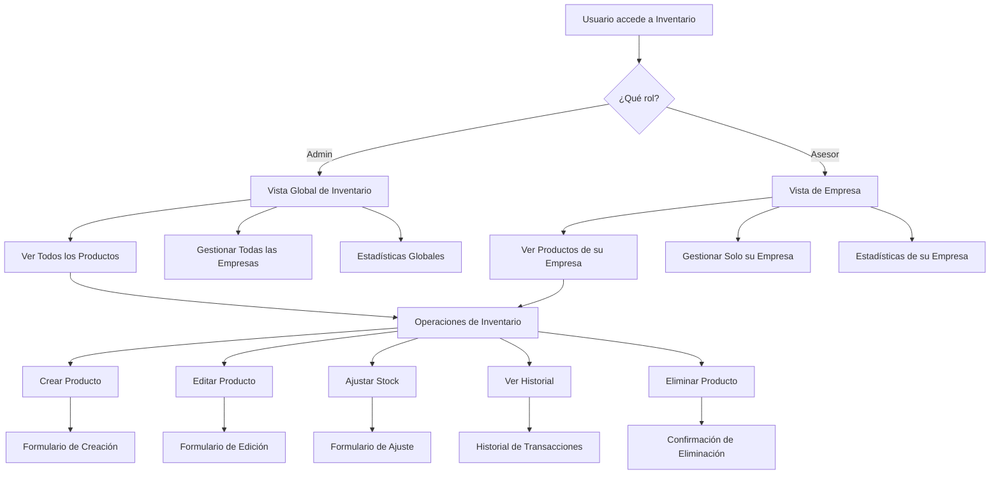

## 3. Flujo de Creación de Producto

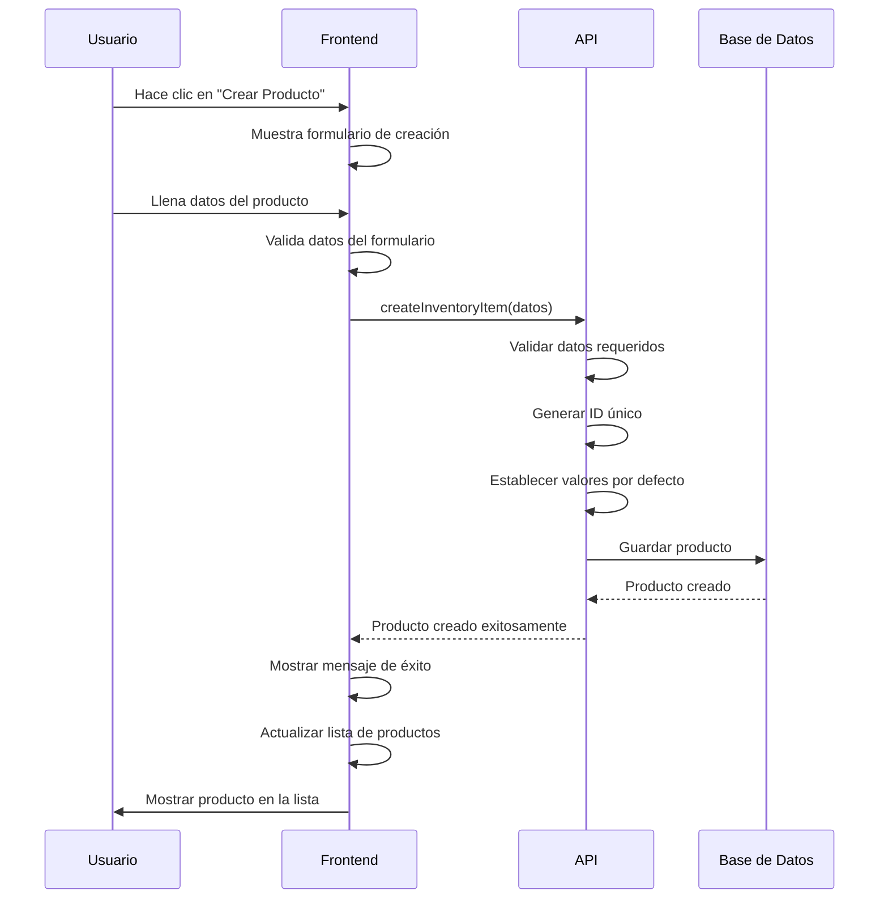

## 4. Flujo de Ajuste de Inventario

```mermaid
flowchart TD
    A[Usuario selecciona "Ajustar Stock"] --> B[Mostrar Modal de Ajuste]
    B --> C[Seleccionar Tipo de Ajuste]
    
    C --> D[Ajuste por Entrada]
    C --> E[Ajuste por Salida]
    C --> F[Ajuste por Corrección]
    C --> G[Ajuste por Pérdida]
    
    D --> H[Ingresar Cantidad Positiva]
    E --> I[Ingresar Cantidad Negativa]
    F --> J[Ingresar Cantidad Corregida]
    G --> K[Ingresar Cantidad Perdida]
    
    H --> L[Validar Cantidad]
    I --> L
    J --> L
    K --> L
    
    L --> M{¿Cantidad válida?}
    M -->|No| N[Mostrar Error]
    M -->|Sí| O[Ingresar Motivo]
    
    N --> C
    O --> P[Ingresar Notas Adicionales]
    P --> Q[Confirmar Ajuste]
    
    Q --> R[Crear Transacción]
    R --> S[Actualizar Stock del Producto]
    S --> T[Registrar en Historial]
    T --> U[Mostrar Confirmación]
    U --> V[Actualizar Vista]
```

## 5. Sistema de Alertas de Stock

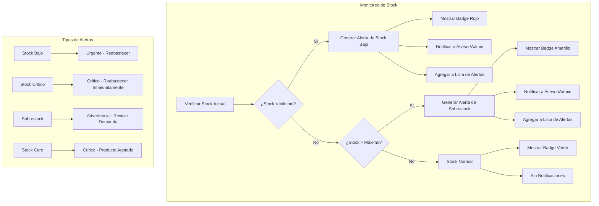

## 6. Flujo de Historial de Transacciones

```mermaid
flowchart TD
    A[Usuario selecciona "Ver Historial"] --> B[Mostrar Filtros de Historial]
    B --> C[Seleccionar Producto]
    B --> D[Seleccionar Fecha Inicio]
    B --> E[Seleccionar Fecha Fin]
    B --> F[Seleccionar Tipo de Transacción]
    
    C --> G[Obtener Historial del Producto]
    D --> G
    E --> G
    F --> G
    
    G --> H[Filtrar Transacciones]
    H --> I[Ordenar por Fecha]
    I --> J[Mostrar en Tabla]
    
    J --> K[Mostrar Detalles de Transacción]
    K --> L[Usuario que realizó la acción]
    K --> M[Fecha y hora]
    K --> N[Cantidad antes]
    K --> O[Cantidad después]
    K --> P[Motivo del cambio]
    K --> Q[Notas adicionales]
    
    J --> R[Exportar Historial]
    R --> S[Generar CSV/PDF]
    S --> T[Descargar Archivo]
```

## 7. Integración con Sistema de Pedidos

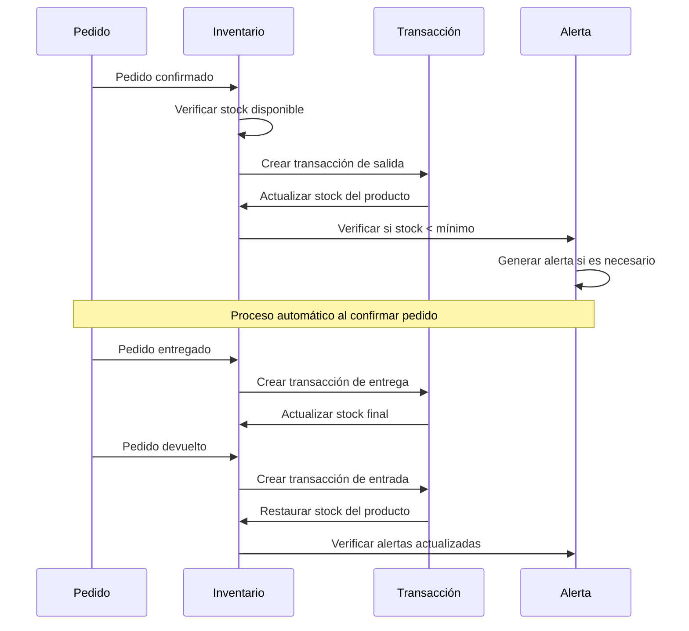

## 8. Dashboard de Estadísticas de Inventario

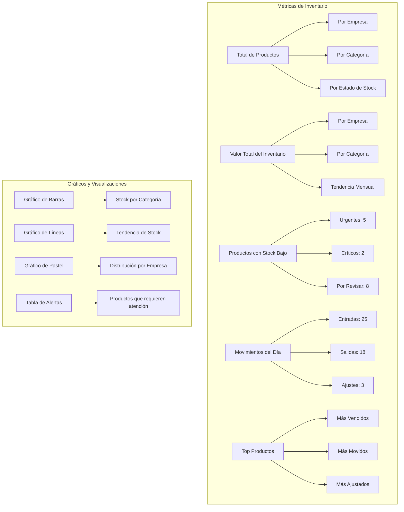

## 9. Flujo de Categorización de Productos

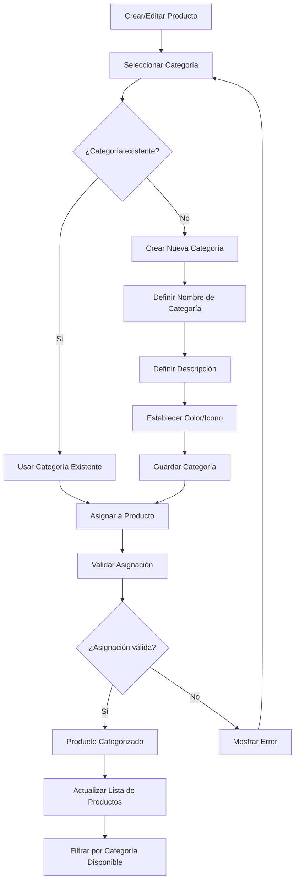

## 10. Sistema de Búsqueda y Filtros

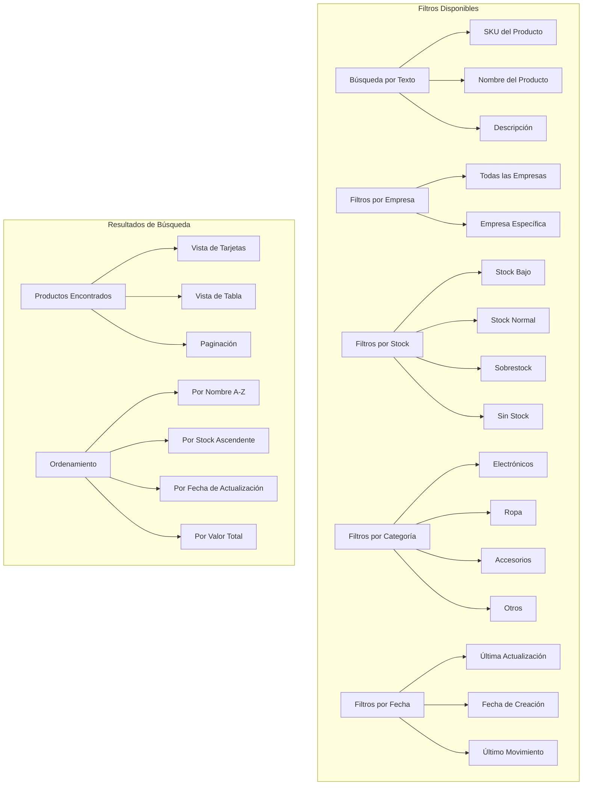

## 11. Flujo de Eliminación de Producto

```mermaid
flowchart TD
    A[Usuario selecciona "Eliminar Producto"] --> B[Verificar Permisos]
    B --> C{¿Tiene permisos?}
    
    C -->|No| D[Mostrar Error de Permisos]
    C -->|Sí| E[Verificar Stock Actual]
    
    E --> F{¿Stock = 0?}
    F -->|No| G[Mostrar Advertencia]
    F -->|Sí| H[Verificar Transacciones Recientes]
    
    G --> I[¿Continuar eliminación?]
    I -->|No| J[Cancelar Eliminación]
    I -->|Sí| H
    
    H --> K{¿Tiene transacciones recientes?}
    K -->|Sí| L[Mostrar Advertencia de Transacciones]
    K -->|No| M[Confirmar Eliminación]
    
    L --> N[¿Eliminar de todas formas?]
    N -->|No| J
    N -->|Sí| M
    
    M --> O[Eliminar Producto]
    O --> P[Eliminar Transacciones Relacionadas]
    P --> Q[Actualizar Lista]
    Q --> R[Mostrar Confirmación]
    
    D --> S[Volver a Lista]
    J --> S
    R --> S
```

## 12. Integración con Sistema de Reportes

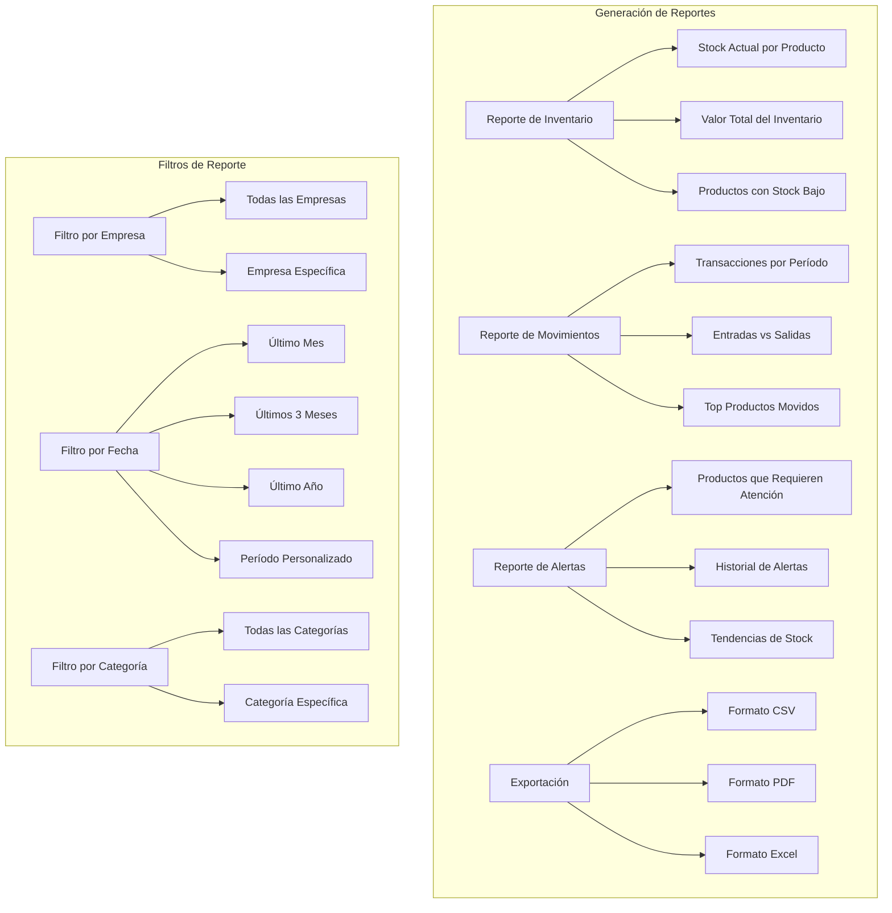

## 13. Flujo de Sincronización con Pedidos

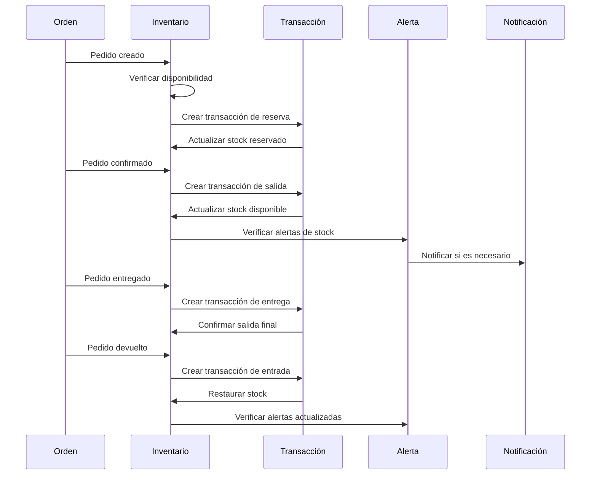

## 14. Dashboard de Monitoreo en Tiempo Real

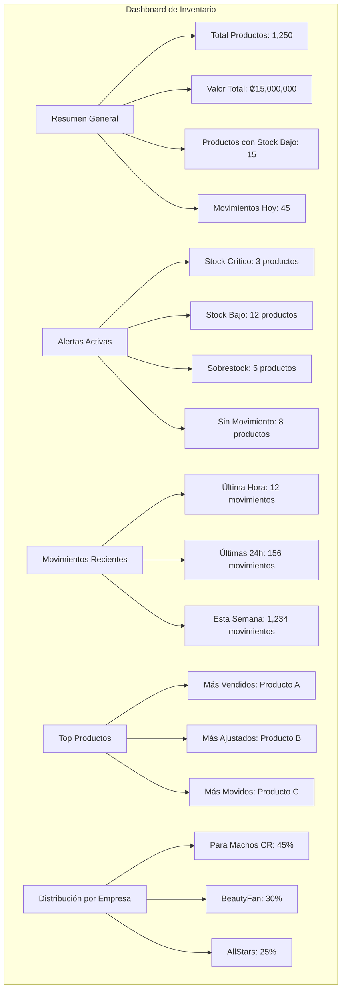

---

## Resumen del Sistema de Inventario

### **Características Principales**
- ✅ **Gestión por roles**: Admin ve todo, Asesor ve solo su empresa
- ✅ **Control de stock en tiempo real**: Actualizaciones automáticas
- ✅ **Sistema de alertas**: Notificaciones de stock bajo/crítico
- ✅ **Historial completo**: Seguimiento de todas las transacciones
- ✅ **Integración con pedidos**: Sincronización automática
- ✅ **Reportes avanzados**: Análisis y exportación de datos

### **Funcionalidades por Rol**

#### **Administrador**
- 🔍 Vista global de todo el inventario
- 📊 Estadísticas de todas las empresas
- ⚙️ Gestión completa de productos
- 📈 Reportes globales

#### **Asesor**
- 🏢 Vista limitada a su empresa
- 📦 Gestión de productos de su empresa
- 📊 Estadísticas de su empresa
- 📋 Reportes de su empresa

### **Beneficios del Sistema**
- 🎯 **Control total**: Visibilidad completa del inventario
- ⚡ **Automatización**: Actualizaciones automáticas con pedidos
- 📊 **Análisis**: Estadísticas y tendencias detalladas
- 🚨 **Alertas**: Notificaciones proactivas de problemas
- 📈 **Escalabilidad**: Fácil gestión de múltiples empresas

*Este sistema de inventario proporciona un control completo y automatizado del stock, con integración total con el sistema de pedidos y gestión por roles.*
