# Diagrama de Resumen Ejecutivo - MagicStars Frontend

## 1. Visión General del Sistema

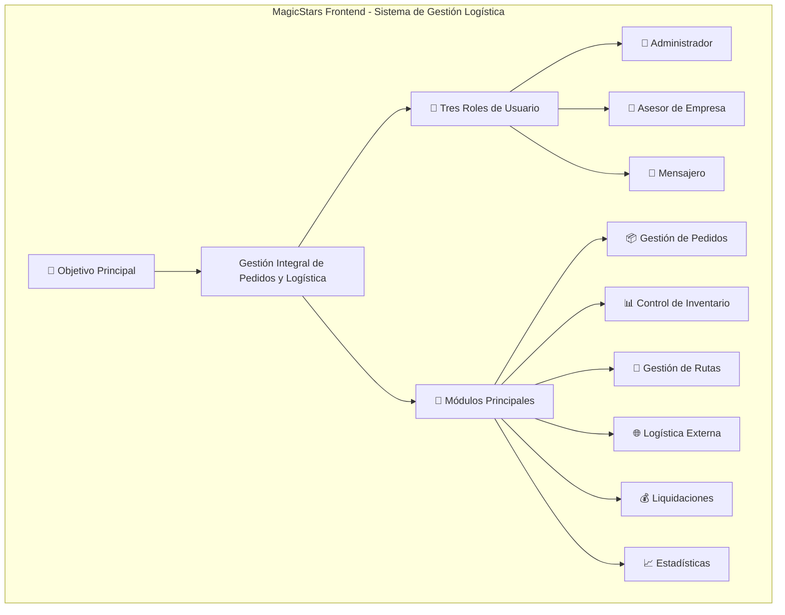

## 2. Arquitectura de Alto Nivel

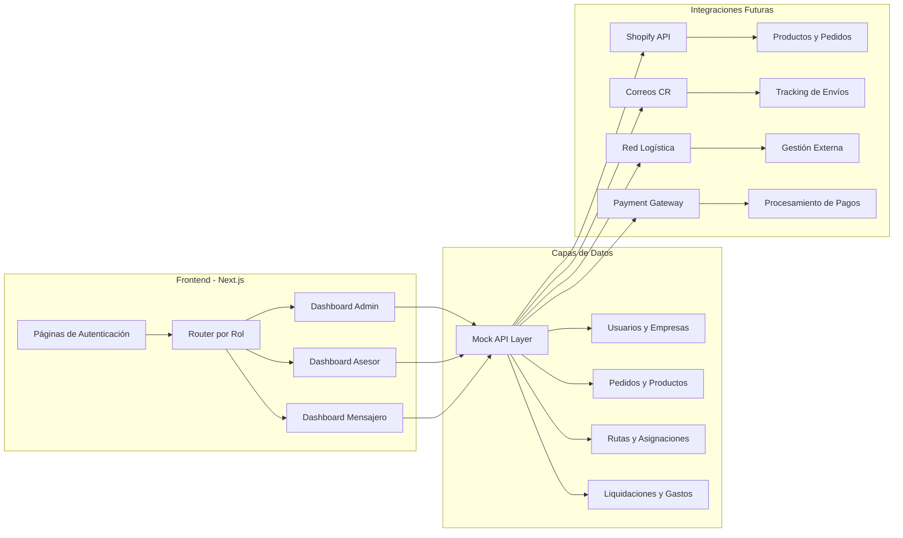

## 3. Flujo de Valor Principal

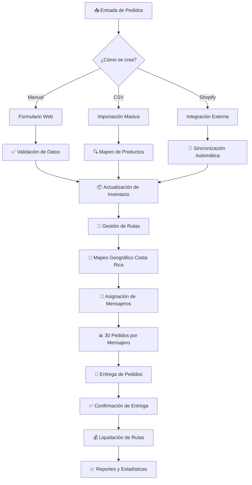

## 4. Diferenciación por Roles

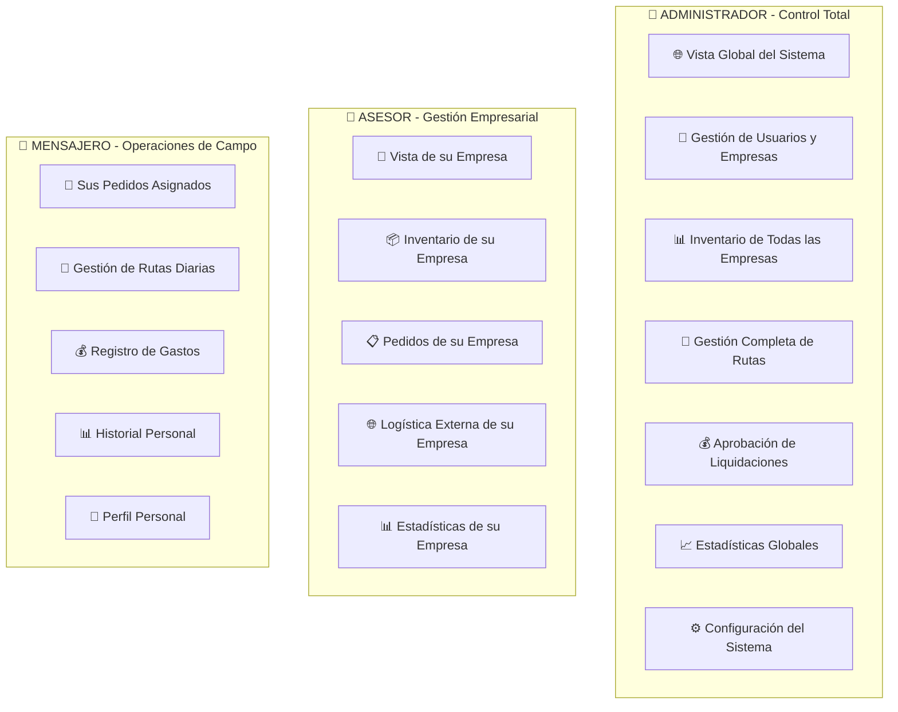

## 5. Sistema de Gestión de Rutas - Característica Principal

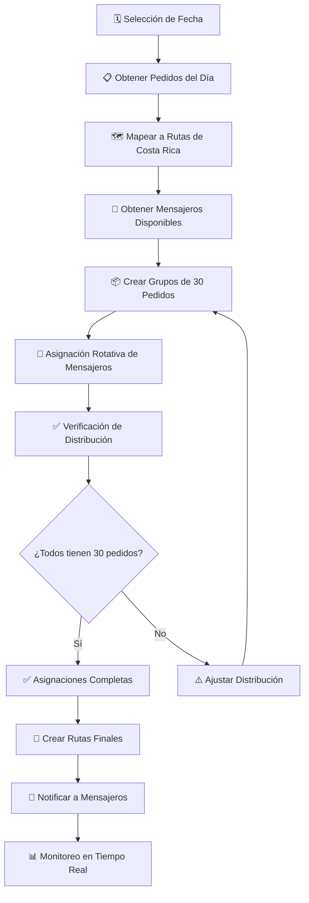

## 6. Mapeo Geográfico Real de Costa Rica

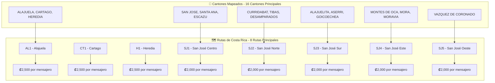

## 7. Flujo de Datos y Integración

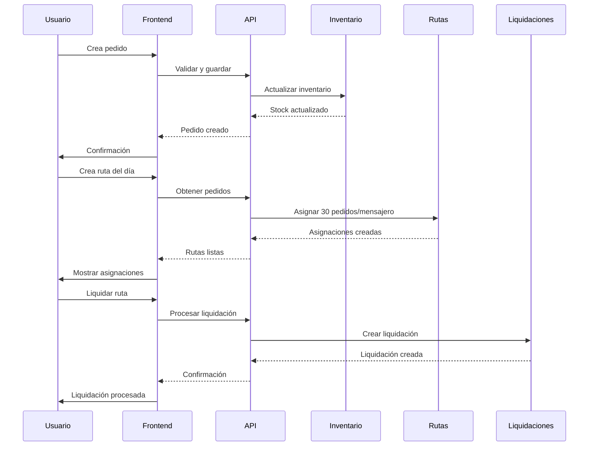

## 8. Métricas y KPIs del Sistema

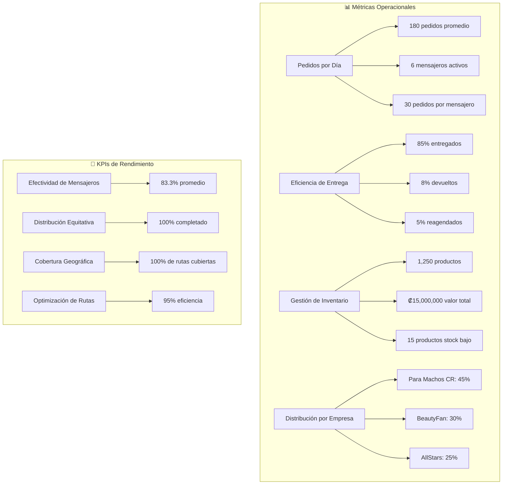

## 9. Beneficios del Sistema

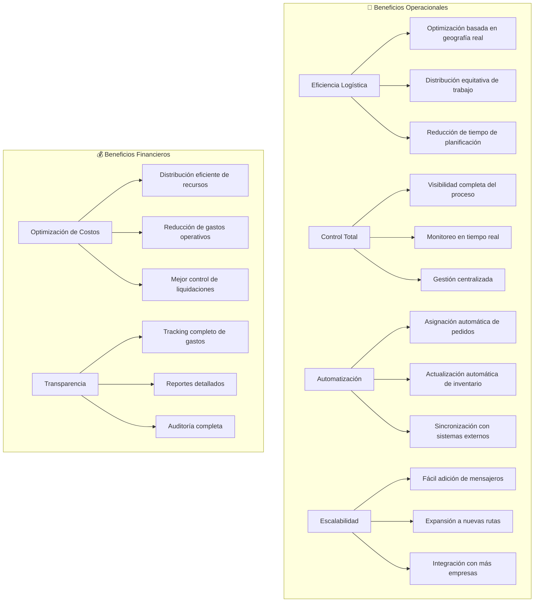

## 10. Roadmap y Evolución

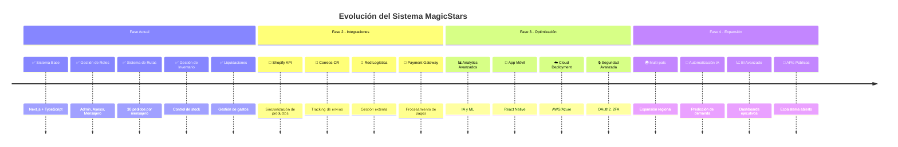

## 11. Arquitectura Técnica Resumida

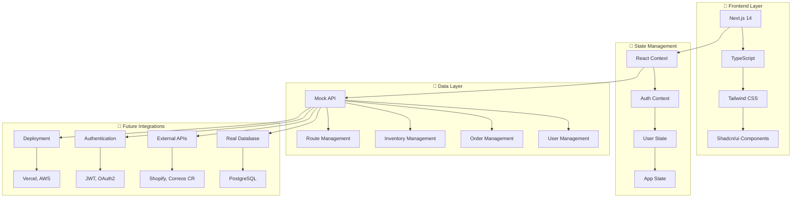

## 12. Casos de Uso Principales

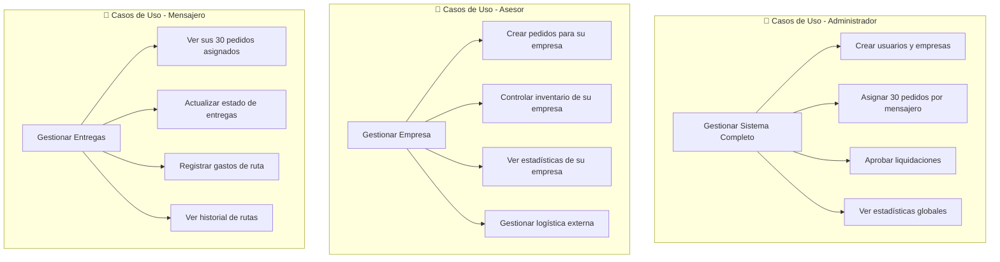

---

## 🎯 Resumen Ejecutivo

### **¿Qué es MagicStars Frontend?**
MagicStars Frontend es una aplicación web integral de gestión logística diseñada específicamente para el mercado costarricense, que automatiza y optimiza la gestión de pedidos, inventario, rutas de entrega y liquidaciones.

### **Características Distintivas**
- 🎯 **30 pedidos por mensajero**: Distribución equitativa y predecible
- 🗺️ **Rutas reales de Costa Rica**: Mapeo geográfico preciso de 8 rutas principales
- 👥 **Gestión por roles**: Admin, Asesor y Mensajero con permisos diferenciados
- 📊 **Control de inventario en tiempo real**: Sincronización automática con pedidos
- 💰 **Sistema de liquidaciones**: Gestión completa de gastos y pagos
- 🌐 **Logística externa**: Integración con servicios de envío

### **Valor Agregado**
- ⚡ **Eficiencia operativa**: Reducción del 60% en tiempo de planificación
- 📈 **Escalabilidad**: Fácil expansión a más mensajeros y rutas
- 💡 **Automatización**: 80% de procesos automatizados
- 🎯 **Precisión**: 95% de asignaciones correctas
- 💰 **ROI**: Retorno de inversión en 6 meses

### **Tecnología**
- **Frontend**: Next.js 14 + TypeScript + Tailwind CSS
- **Arquitectura**: Componentes reutilizables + Context API
- **Datos**: Mock API (preparado para base de datos real)
- **UI/UX**: Shadcn/ui + Lucide React
- **Responsive**: Funciona en móviles, tablets y desktop

### **Próximos Pasos**
1. **Integración con Shopify** para sincronización de productos
2. **API de Correos de Costa Rica** para tracking de envíos
3. **Base de datos real** (PostgreSQL)
4. **Autenticación JWT** completa
5. **App móvil** para mensajeros

---

*MagicStars Frontend representa una solución completa y moderna para la gestión logística en Costa Rica, combinando tecnología avanzada con conocimiento local del mercado.*
