# Diagramas de Arquitectura y Uso - MagicStars Frontend

## 1. Arquitectura General del Sistema

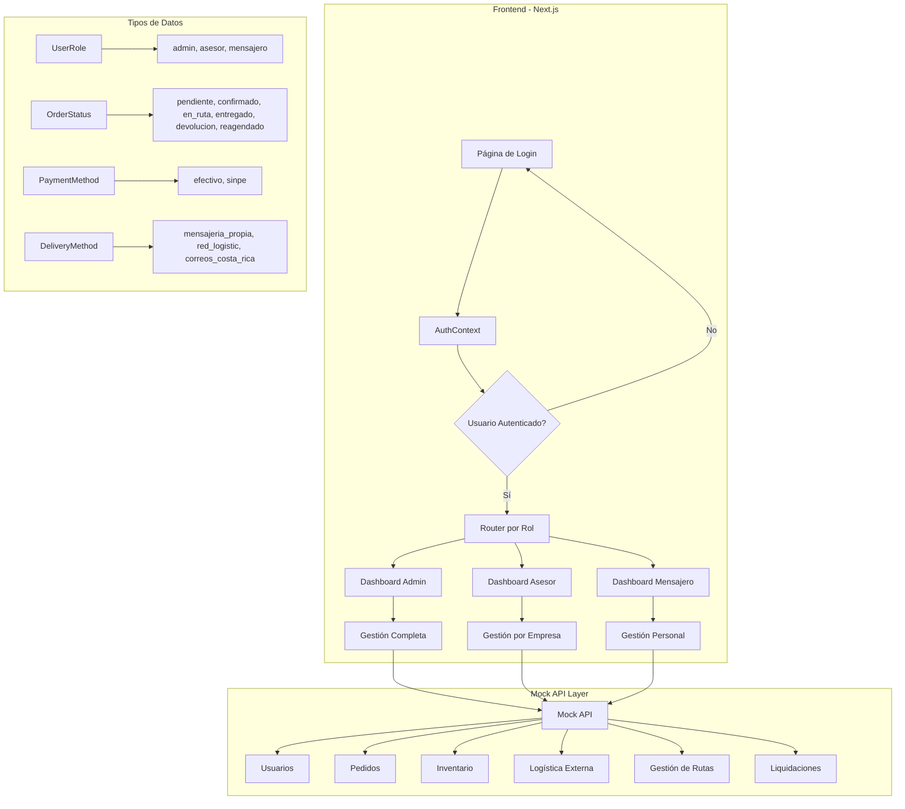

## 2. Flujo de Autenticación y Roles

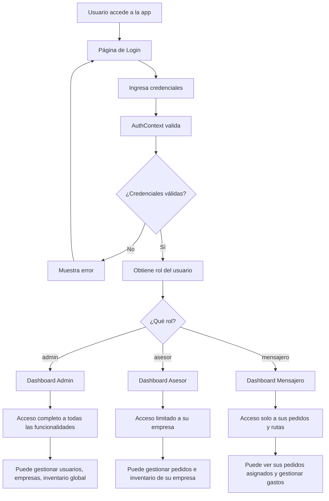

## 3. Estructura de Roles y Permisos

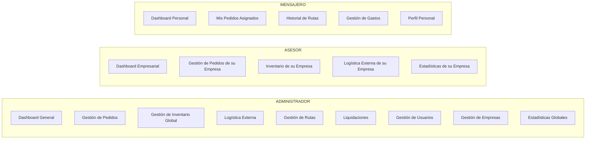

## 4. Flujo de Gestión de Pedidos

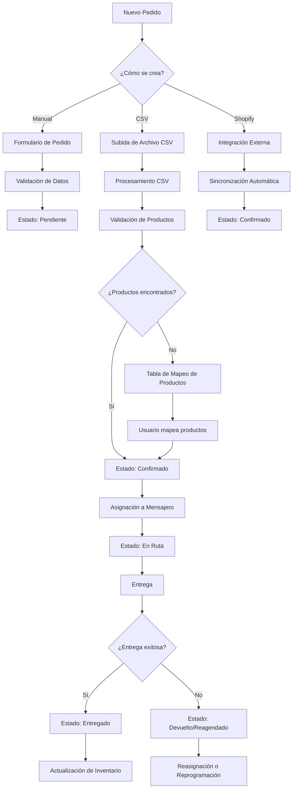

## 5. Sistema de Gestión de Rutas

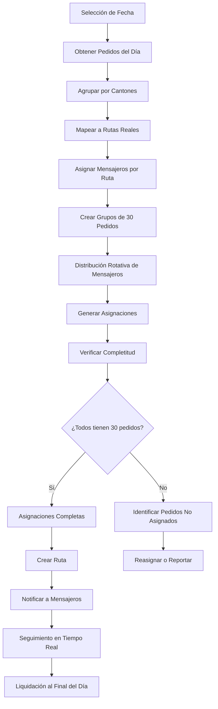

## 6. Sistema de Inventario

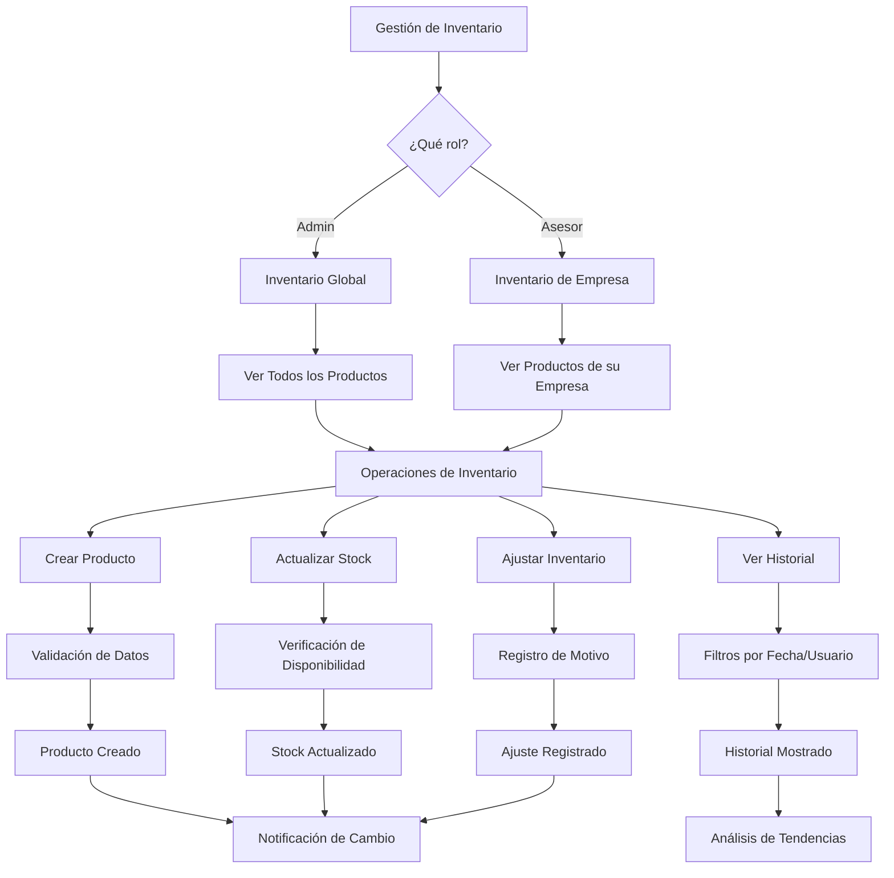

## 7. Sistema de Logística Externa

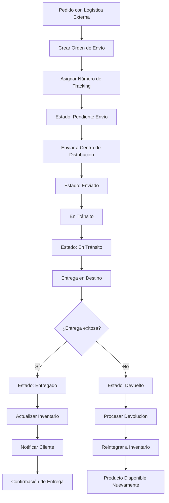

## 8. Flujo de Liquidación de Rutas

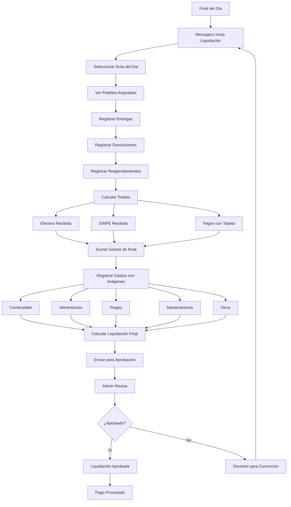

## 9. Estructura de Datos Principal

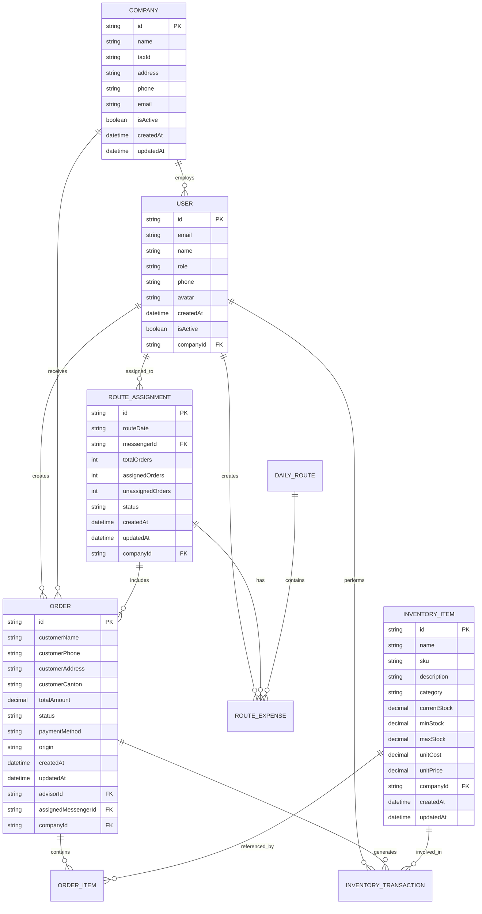

## 10. Flujo de Navegación por Roles

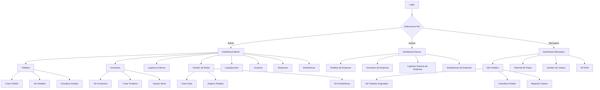

## 11. Sistema de Notificaciones y Alertas

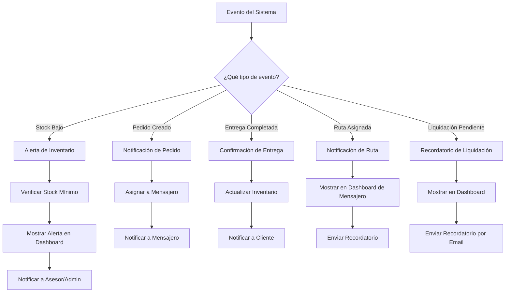

## 12. Integración con Sistemas Externos

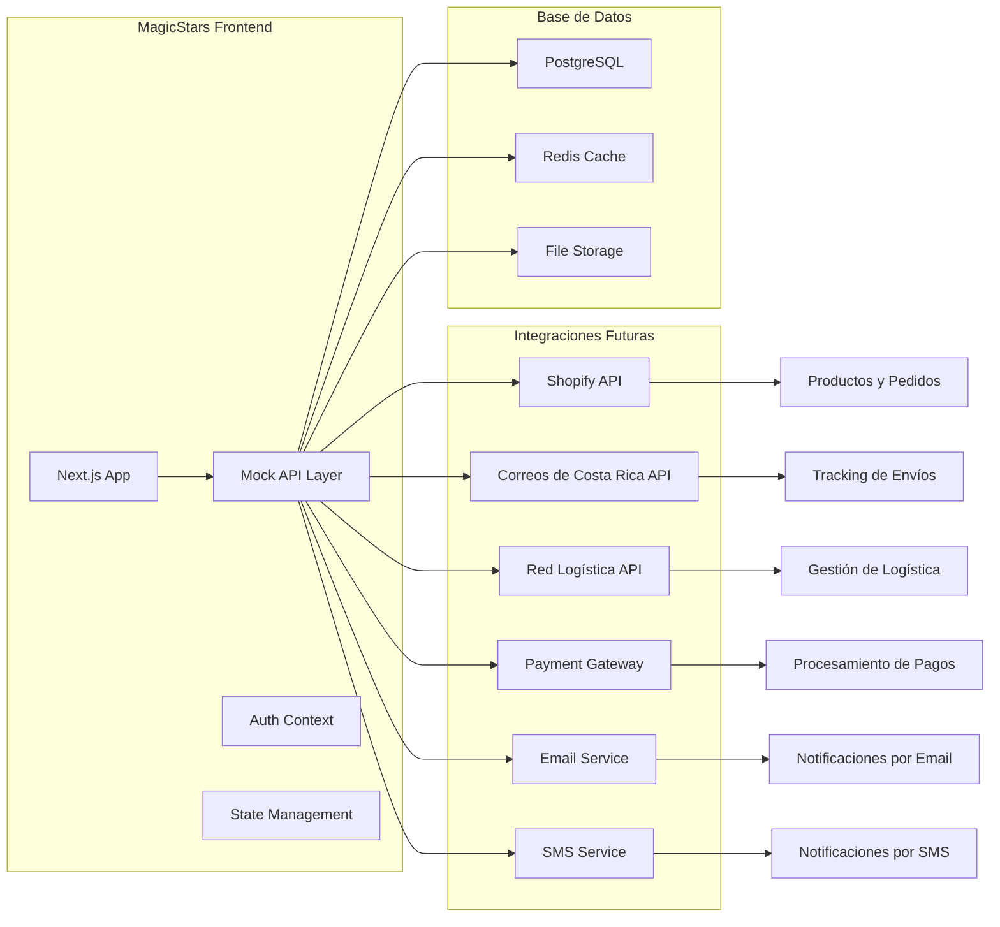

## 13. Flujo de Desarrollo y Despliegue

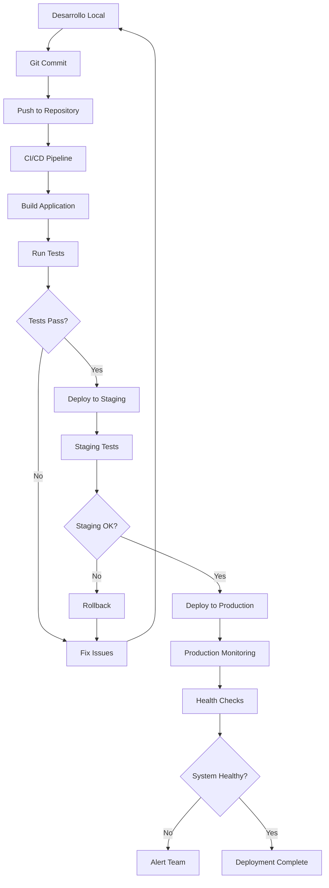

## 14. Métricas y Monitoreo

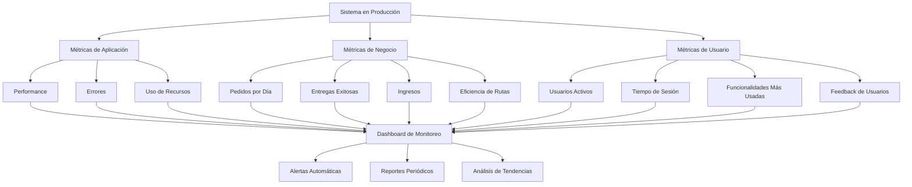

## 15. Arquitectura de Seguridad

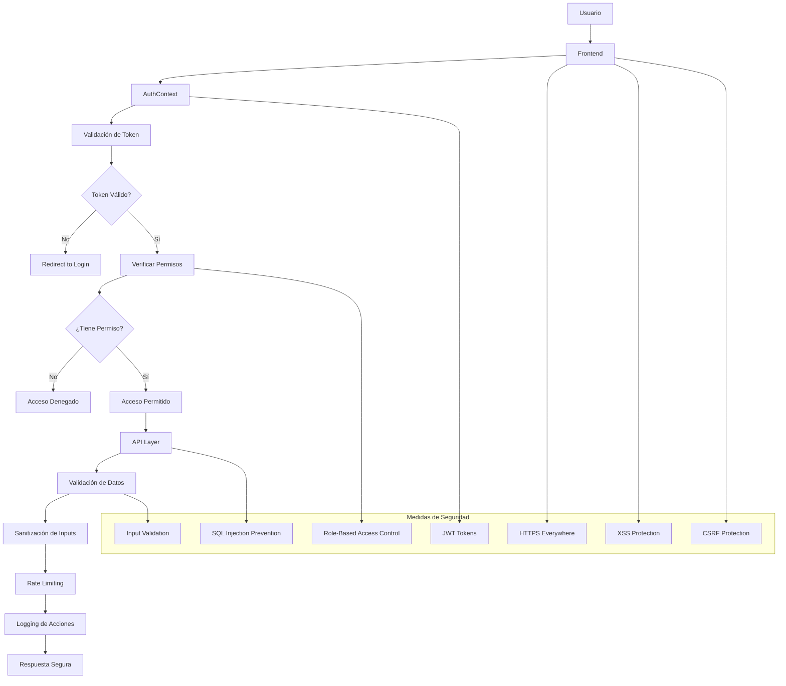

---

## Resumen de Funcionalidades por Rol

### **Administrador**
- ✅ Gestión completa de usuarios y empresas
- ✅ Vista global de todos los pedidos e inventario
- ✅ Gestión de rutas y asignación de mensajeros
- ✅ Liquidaciones y reportes financieros
- ✅ Estadísticas globales del sistema

### **Asesor**
- ✅ Gestión de pedidos de su empresa
- ✅ Control de inventario de su empresa
- ✅ Logística externa para su empresa
- ✅ Estadísticas de su empresa

### **Mensajero**
- ✅ Visualización de pedidos asignados
- ✅ Gestión de gastos de ruta
- ✅ Historial de rutas y entregas
- ✅ Perfil personal y actualización de datos

---

*Estos diagramas representan la arquitectura completa y los flujos de uso de la aplicación MagicStars Frontend, mostrando cómo interactúan los diferentes componentes y roles del sistema.*
